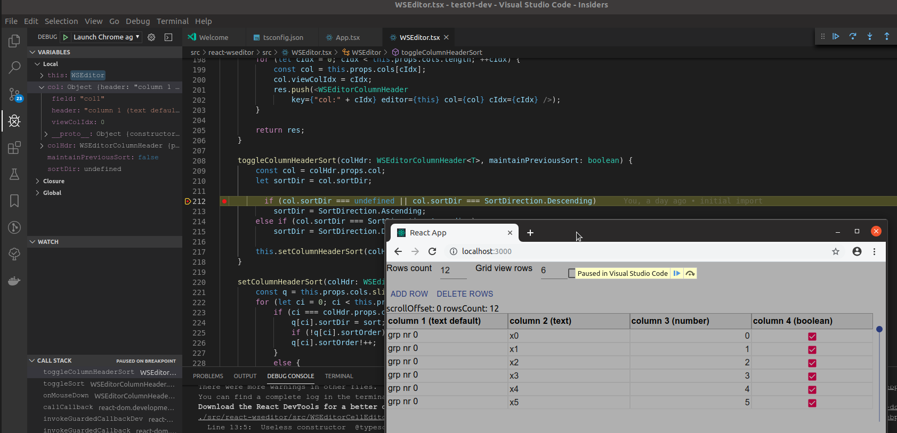

# react-wseditor test01-dev

development test



this project associate react-wseditor as git submodule in order to allow debug directly tsx files.

## how this project was built

- create source tree skeleton

```sh
create-react-app test01-dev --typescript
cd test01-dev
yarn add @material-ui/core @material-ui/icons react-icons @types/react-icons

cd src
git submodule add https://github.com/devel0/react-wseditor

cd ..

cd ..
```

- setup `tsconfig.json`

```json
  "exclude":[
    "src/react-wseditor"
  ],
  "include": [
    "src"
  ]  
```

- setup `.env`

```
BROWSER=none
```

- setup `.vscode/launch.json`

```json
{    
    "version": "0.2.0",
    "configurations": [                
        {
            "type": "chrome",
            "request": "launch",
            "name": "Launch Chrome against localhost",
            "url": "http://localhost:3000",
            "webRoot": "${workspaceFolder}"            
        }
    ]
}
```

- debug session

```sh
yarn start
```

from vscode hit F5 after yarn started